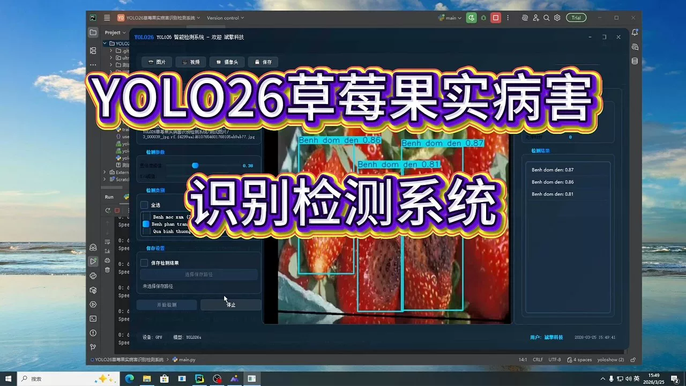
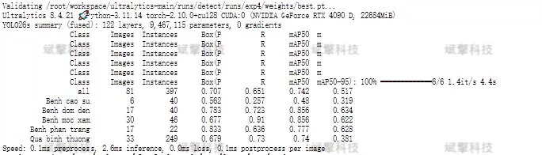
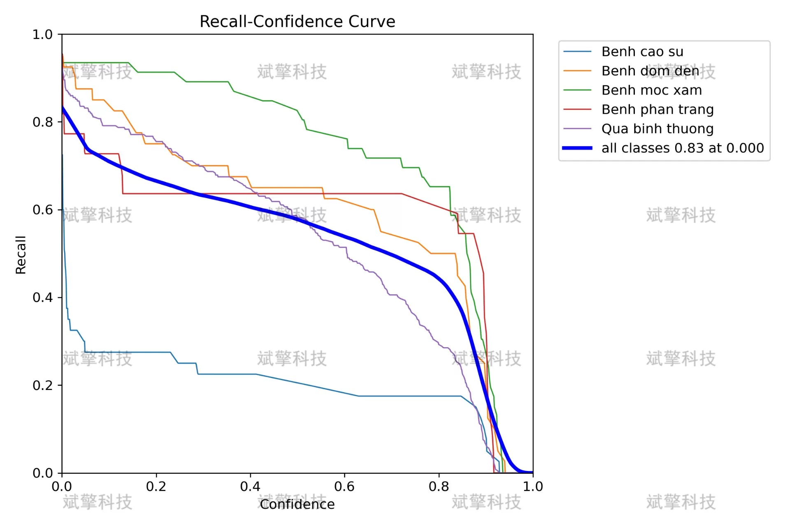
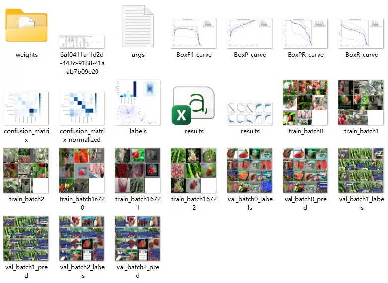
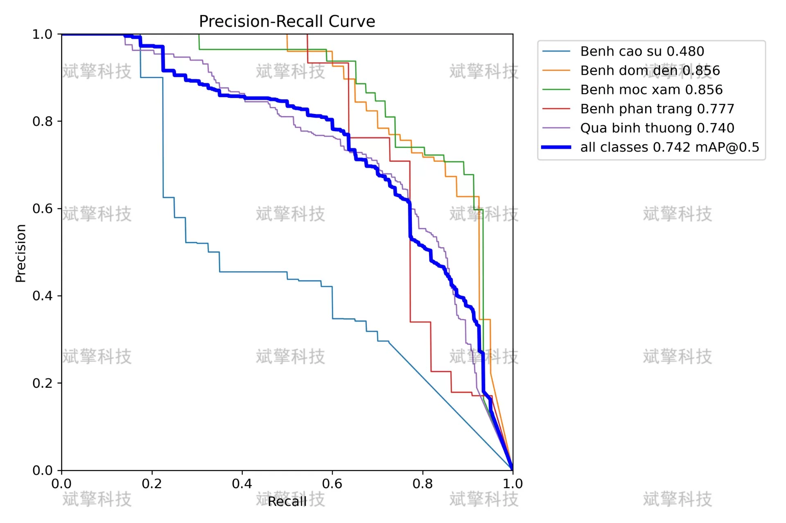
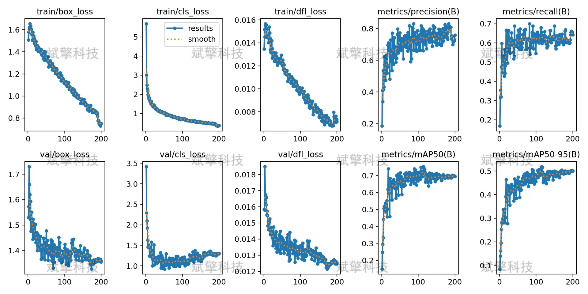
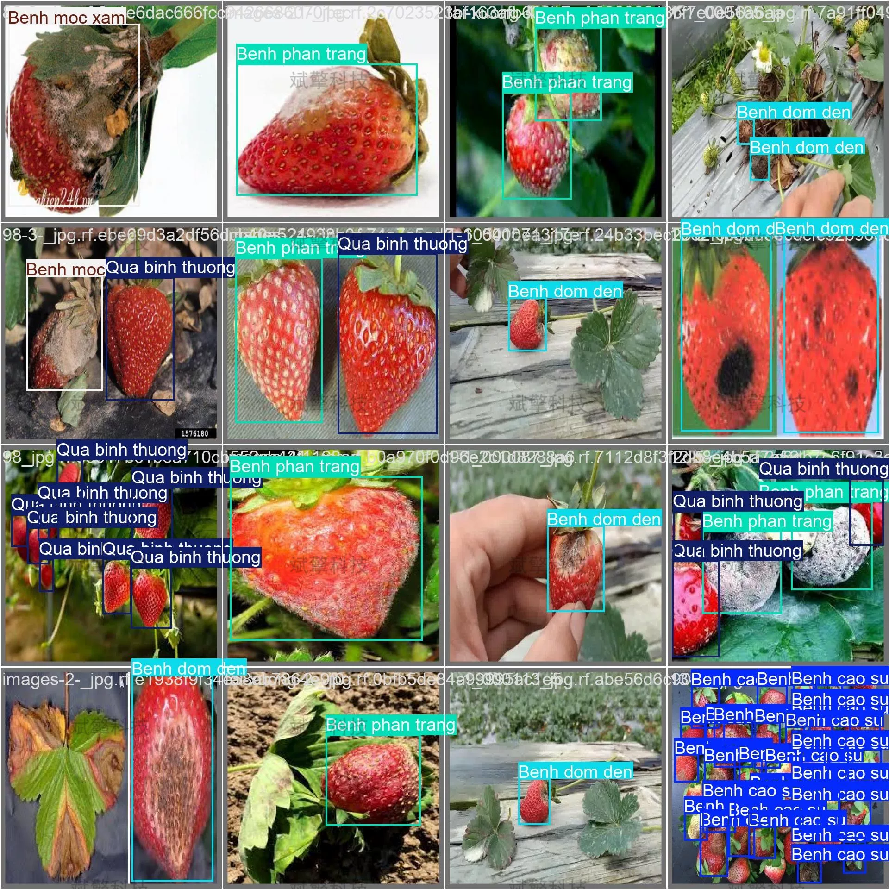
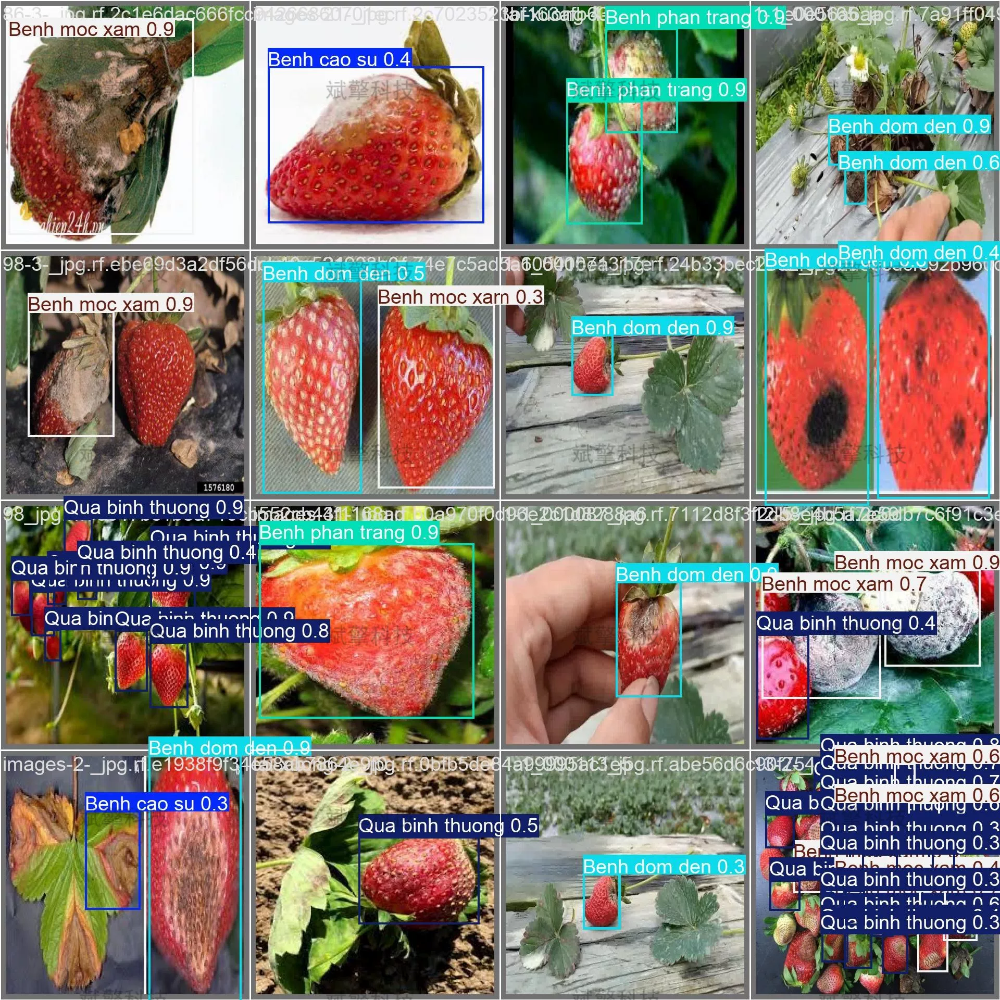
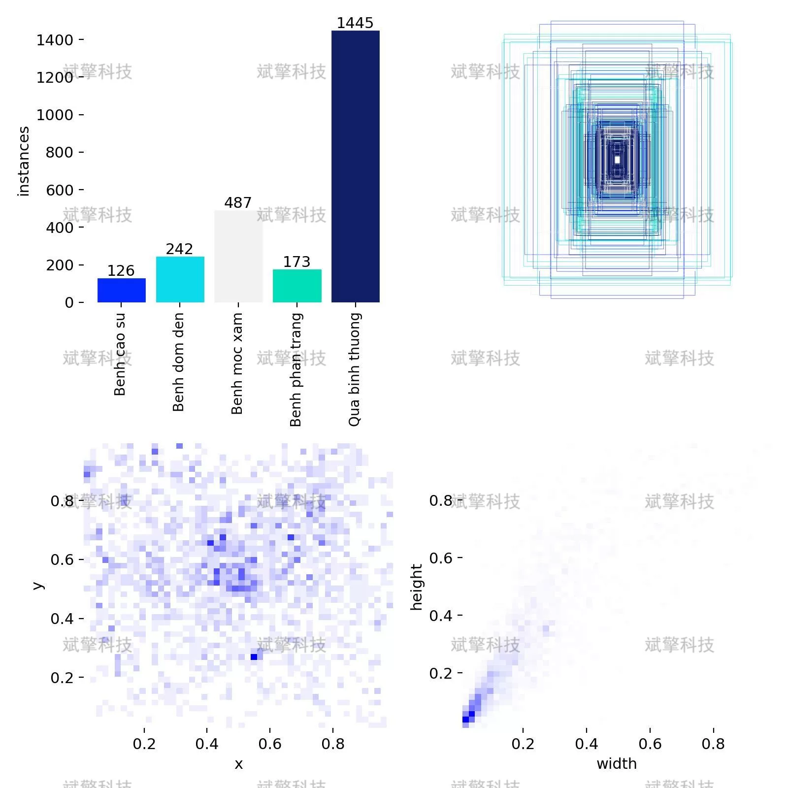

# YOLO26 Strawberry Fruit Disease Identification and Detection System

## Body

The YOLO26 strawberry fruit disease detection system based on YOLO26 research (project source code + dataset + model weights + UI interface + python + deep learning + remote environment deployment)

Strawberries are prone to various diseases during their growth process, severely affecting the quality and yield of the fruits. This study builds a strawberry fruit disease detection system based on the YOLO26 object detection algorithm, achieving automatic detection and classification of five key states: Benh cao su (rubber disease), Benh dom den (black spot disease), Benh moc xam (gray mold disease), Benh phan trang (powdery mildew), and Qua binh thuong (normal fruit). The experimental dataset contains 884 labeled images, with 700 training images, 81 validation images, and 103 test images. After 120 rounds of training, the model achieved an overall mAP50 of 0.742 on the validation set, with mAP50 values of 0.856 for Benh dom den and Benh moc xam, demonstrating good detection performance. This study provides a feasible solution for intelligent identification of strawberry diseases, holding significant agricultural application value.

The dataset consists of 5 categories, with the specific category names and their meanings as follows:
Benh cao su - Rubber disease
Benh dom den - Black spot disease
Benh moc xam - Gray mold disease
Benh phan trang - White powder disease
Qua binh thuong - Normal fruit
The total number of labeled images in the dataset is 884, which is divided into training set, validation set, and test set at a ratio of approximately 8:1:1.

Train set: 700 images, used for model parameter learning.
Validation set: 81 images, used for model tuning and performance validation.
Test set: 103 images, used for final model performance evaluation.

Free remote installation appointments. Unsuccessful, full refund.
Purchase includes the following resources (auto-unlocked by Baidu Pan)
YOLO recognition detection project complete source code
YOLO format dataset
Training code + UI interface code
Trained model + result images
Software installer package
Add WeChat to make a remote installation appointment (shown automatically after purchase) —— Unsuccessful, full refund

⚙️ Core Function Modules
Detection Capabilities
    Image Detection: Upon upload, returns detection boxes + category information.
    Video Detection: Supports video files, precise analysis of frames by frame.
    Camera Real-Time Detection: Attaches USB cameras to achieve dynamic monitoring.

️ Interaction and Control
    Target Filtering: Choose one or more categories for detection freely.
    Parameter Real-Time Adjustment: Adjustable confidence threshold & IoU threshold, flexibly control accuracy.
    Result Saving: One-click save of image/video/camera detection results.

System and Data

User Login and Registration: Supports password strength detection + Encrypted storage
Logging: Auto-records operation and error information (with timestamp)

## Images

## Payment

Here is a pay link on Stripe ( https://buy.stripe.com/3cs8yP7sY87d0vu9AB ). Please contact me lonlonago@foxmail.com after funding $89, and I will send you a complete data files , thank you!

